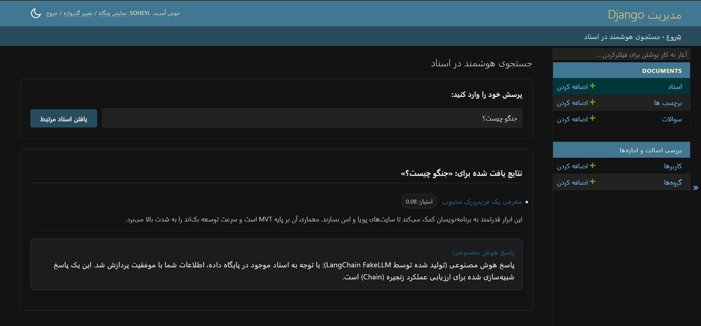
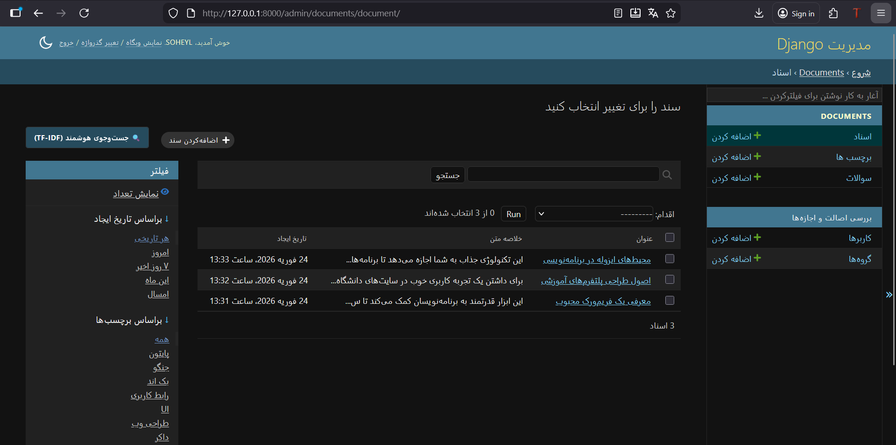
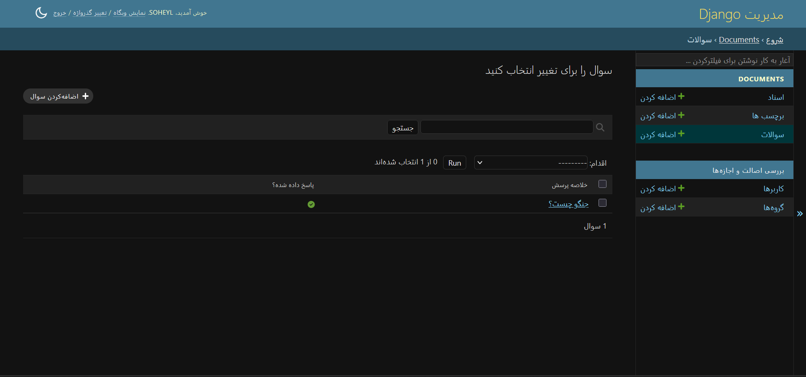

# سیستم جست‌وجوی معنایی و پرسش‌وپاسخ اسناد (AI-Powered Document Search & QA)

این پروژه، یک سیستم هوشمند برای مدیریت، جست‌وجوی معنایی و پاسخ‌گویی به سوالات بر اساس اسناد متنی است. این سیستم با استفاده از ترکیب الگوریتم‌های یادگیری ماشین (TF-IDF) و زنجیره‌های هوش مصنوعی (LangChain) توسعه یافته و در بستر فریم‌ورک قدرتمند Django پیاده‌سازی شده است.

## 🌟 ویژگی‌های کلیدی و برجسته (Key Features)

- **موتور جست‌وجوی هوشمند (TF-IDF):** استفاده از `scikit-learn` برای محاسبه شباهت برداری (Cosine Similarity) بین پرسش کاربر و ترکیبی از متن، عنوان و **برچسب‌های (Tags)** اسناد.
- **ادغام با LangChain:** پردازش اسناد یافت‌شده و تولید پاسخ ساختاریافته. (در این نسخه، برای پایداری ۱۰۰٪ سیستم و جلوگیری از خطاهای سرورهای رایگان، از مکانیزم `FakeLLM/Fallback` به عنوان جایگزینِ امن استفاده شده است).
- **راه‌اندازی خودکار (Auto-Seeding):** تزریق خودکارِ داده‌های نمونه (۳ سند و ۲ پرسش) به دیتابیس در زمان اجرای داکر، بدون نیاز به هیچ‌گونه تنظیمات دستی.
- **پنل مدیریت اختصاصی و فارسی:** کاملاً راست‌چین و بومی‌سازی شده به همراه صفحات کاستوم برای فرم جست‌وجوی هوشمند.

### 🏆 قابلیت‌های امتیازآور (Bonus Features)
این پروژه علاوه بر نیازمندی‌های پایه، شامل پیاده‌سازی‌های پیشرفته‌ی زیر است:
1. **سیستم Cache (کشینگ):** پاسخ‌های تولیدشده در حافظه موقت (Django Cache) ذخیره می‌شوند تا در صورت تکرار سوال، پاسخ در کسری از ثانیه و بدون پردازش مجدد برگردانده شود.
2. **تاریخچه و گزارش‌گیری:** تمام جست‌وجوها و پاسخ‌های تولیدشده در دیتابیس (مدل `Question`) ذخیره شده و از طریق پنل ادمین قابل پیگیری و گزارش‌گیری هستند.
3. **آزمون‌های خودکار (Unit Tests):** پوششِ کاملِ تست‌ها برای دیتابیس، منطقِ جست‌وجو و خروجیِ API.

---

## 🛠 تکنولوژی‌های استفاده شده

- **زبان و فریم‌ورک:** `Python 3.12` | `Django 5.1`
- **هوش مصنوعی و پردازش متن:** `LangChain` | `scikit-learn`
- **زیرساخت و استقرار:** `Docker` | `Docker Compose`
- **پایگاه داده:** `SQLite`

---

## 🚀 راهنمای نصب و راه‌اندازی (با داکر)

برای اجرای این پروژه، به لطفِ استفاده از Docker و اسکریپت‌های اتوماسیون، تنها به **یک دستور** نیاز دارید!

1. ابتدا مخزن پروژه را دریافت کرده و وارد پوشه آن شوید.
2. دستور زیر را در ترمینال اجرا کنید:

```bash
docker-compose up --build
```

**چه اتفاقی می‌افتد؟**
سیستم به صورت خودکار پکیج‌ها را نصب می‌کند، دیتابیس را می‌سازد (Migrate)، داده‌های نمونه را تزریق می‌کند و سرور را روی پورت `8000` بالا می‌آورد.

---

## 💻 نحوه استفاده از سامانه

### ۱. پنل مدیریت (رابط کاربری)
پس از اجرای پروژه، مرورگر خود را باز کرده و به آدرس زیر بروید:
👉 `http://localhost:8000/admin/`

* **جست‌وجوی هوشمند:** در صفحه لیستِ اسناد، روی دکمه‌ی آبی‌رنگ **«🔍 جست‌وجوی هوشمند (TF-IDF)»** در بالای صفحه کلیک کنید تا وارد محیط پرسش‌وپاسخ شوید.

### ۲. رابط برنامه‌نویسی (API)
سیستم دارای یک API استاندارد برای اتصال کلاینت‌های خارجی (فرانت‌اند/موبایل) است. 

📚 **برای مشاهده‌ی نحوه ارسال درخواست، ساختار JSON و خطاهای احتمالی، لطفاً به فایل زیر مراجعه کنید:**
👉 [مستندات کامل API (API_DOCUMENTATION.md)](API_DOCUMENTATION.md)

---

## 🧪 اجرای آزمون‌های خودکار (Running Tests)

برای اطمینان از صحت عملکرد موتور جست‌وجو، دیتابیس و سرویس API، آزمون‌های واحد (Unit Tests) در پروژه تعبیه شده‌اند. 
در حالی که پروژه با داکر در حال اجراست، در یک ترمینالِ جدید دستور زیر را وارد کنید:

```bash
docker-compose exec web python manage.py test
```
با اجرای این دستور، محیطِ تستیِ ایزوله ساخته شده و تمام سناریوها اعتبارسنجی می‌شوند.

## 📸 اسکرین‌شات‌های سیستم



